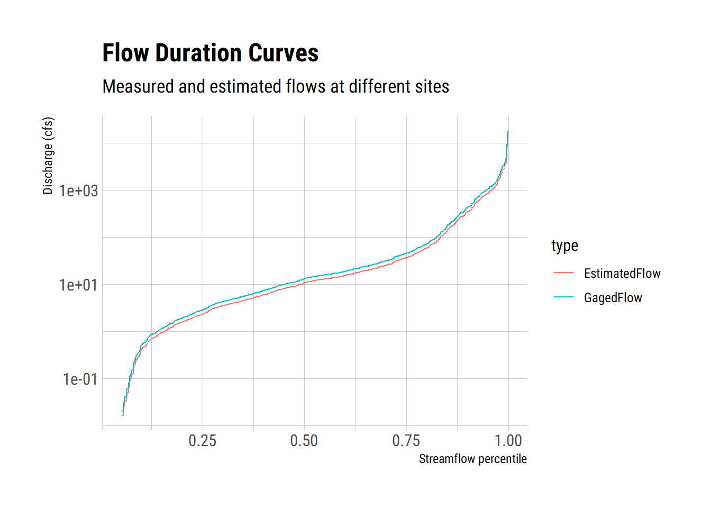

<!-- README.md is generated from READOTHER.Rmd. Please edit that file -->

# dartx

**dartx** is an R package to facilitate applying correction factors to
streamflows calculated with the Drainage Area Ratio Method (DAR).
**dartx** consists of a single function that calculates the streamflow
probability (the non-exceedance probability), identifies the appropriate
correction factor, and calculates the streamflow of an ungaged station
with a user provided drainage area ratio.

## Installation

You can install the the development version from
[GitHub](https://github.com/) with:

``` r
# install.packages("devtools")
devtools::install_github("mps9506/dartx")
```

Currently there are no plans to submit the package to CRAN.

**dartx** requires the [`dplyr`](https://github.com/tidyverse/dplyr),
[`fuzzyjoin`](https://github.com/dgrtwo/fuzzyjoin) packages. The
examples below use [`ggplot2`](https://github.com/tidyverse/ggplot2) and
[`dataRetrieval`](https://github.com/USGS-R/dataRetrieval) packages.

## Background

The DAR method is a simple method to estimate streamflows with the
assumption that the relationship between streamflows at a gaged site and
an ungaged site are equivelent to the ratio of the drainage areas.
Asquith, Roussel, and Vrabel (2006) investigated the assumption of unity
on the exponent parameter and multiplicative bias correction parameter
in the DAR equation when applied to streams in Texas. The results
includes suggested emprically derived parameters values for the DAR
exponent at 54 percentiles of streamflow. When using these percentiles,
bias correction approaches unity and can be assumed equal to 1.

More details are available in: Asquith, William H., Meghan C. Roussel,
and Joseph Vrabel. 2006. “Statewide Analysis of the Drainage-Area Ratio
Method for 34 Streamflow Percentile Ranges in Texas.” 2006–5286. U.S.
Geological Survey Scientfic Investigations Report. U.S. Geological
Survey. <https://pubs.usgs.gov/sir/2006/5286/pdf/sir2006-5286.pdf>.

## Usage

At minimum the user must provide (1) a dataframe with streamflow from
the desired reference gage and (2) the drainage area ratio as a number.
**dartx** calculates the non-exceedance values, determines the
correction value, and applies it to the DAR calculation. And example
using the USGS `dataRetrieval` package is shown below.

``` r
## Load packages
library(dplyr)
library(dataRetrieval)
library(dartx)
library(ggplot2)
```

``` r
## Get drainage areas for two watersheds with dataRetrieval
siteInfo <- readNWISsite(c('08110100', '08109800'))
siteInfo$contrib_drain_area_va
#> [1] 244 195
```

``` r
## Download three years of streamflow data from 08110100
Davidson <- readNWISdv('08110100', "00060", "2015-01-01", "2017-12-31")
Davidson <- renameNWISColumns(Davidson)
head(Davidson)
#>   agency_cd  site_no       Date   Flow Flow_cd
#> 1      USGS 08110100 2015-01-01   4.82       A
#> 2      USGS 08110100 2015-01-02  17.20       A
#> 3      USGS 08110100 2015-01-03 258.00       A
#> 4      USGS 08110100 2015-01-04 288.00       A
#> 5      USGS 08110100 2015-01-05  91.80       A
#> 6      USGS 08110100 2015-01-06  40.90       A
```

The DAR is the area of the ungaged site divided by the gaged
site.

``` r
dar <- siteInfo$contrib_drain_area_va[2]/siteInfo$contrib_drain_area_va[1]
dar
#> [1] 0.7991803
```

Apply the dartx function to get streamflows at the ungaged site.

``` r
output <- dartx(Davidson, flow = Flow, dar = dar)
head(output)
#>   agency_cd  site_no       Date Flow Flow_cd   cume_dist   exp Q
#> 1      USGS 08110100 2015-08-29    0       A 0.000911577 0.885 0
#> 2      USGS 08110100 2015-08-30    0       A 0.001823154 0.885 0
#> 3      USGS 08110100 2015-08-31    0       A 0.002734731 0.885 0
#> 4      USGS 08110100 2015-09-01    0       A 0.003646308 0.885 0
#> 5      USGS 08110100 2015-09-02    0       A 0.004557885 0.885 0
#> 6      USGS 08110100 2015-09-03    0       A 0.005469462 0.885 0
```



Make a quick comparison to the actual measured flows at site 08109800

``` r
Yegua <- readNWISdv('08109800', "00060", "2015-01-01", "2017-12-31")
Yegua <- renameNWISColumns(Yegua)

comparison <- Yegua %>%
  left_join(output, by = "Date") %>%
  filter(Q > 0)


ggplot(comparison) +
  geom_point(aes(log(Flow.x), log(Q)), alpha = 0.4) +
  geom_smooth(aes(log(Flow.x), log(Q)), alpha = 0.4, method = "lm") +
  geom_abline(intercept = 0, slope = 1) +
  coord_equal() +
  theme_ipsum_rc(axis = TRUE) +
  labs(subtitle = "Measured Flow vs Estimated Flow at the same site",
       x = "log Measured Flow",
       y = "log DAR Estimated Flow")
```


